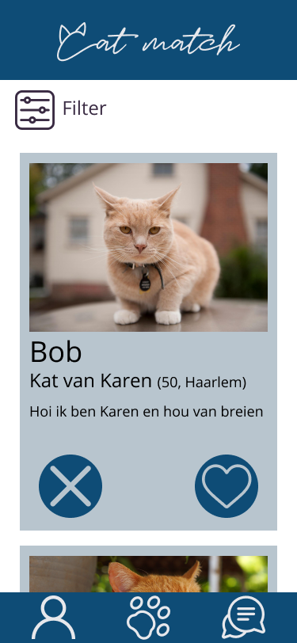
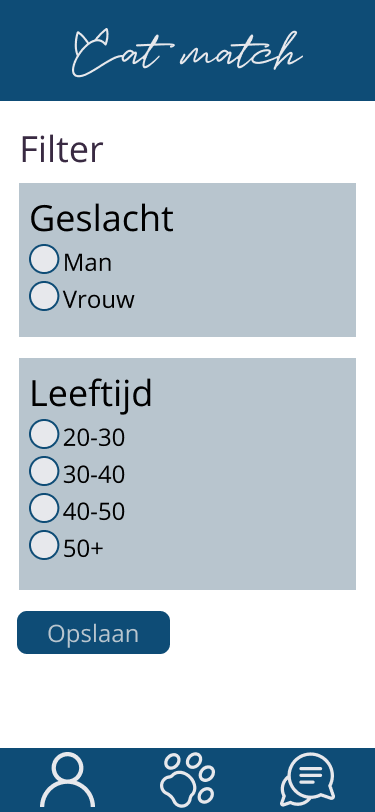
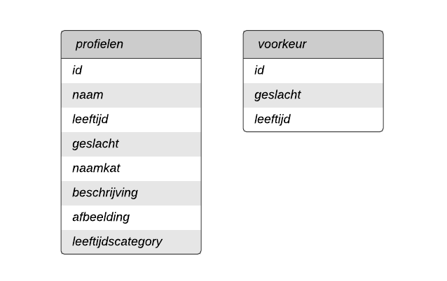

# 

## Inhoudsopgave
* [Opdracht](#Opdracht)
* [Concept](#Concept)
* [Feature](#Features) 
* [Installeren](#Installeren) 

## Opdracht
Als opdracht voor dit project moet er een matching app gemaakt worden. 

## Concept
Cat match is een matching app waarin je andere mensen met katten kunt ontmoeten. In de app zie je alleen een foto van de kat en niet het baasje. Hierdoor wordt je alleen gematch op basis van je hobbies.




## Feature
Als feature heb ik gekozen voor een filter systeem om zo alleen mensen te zien waarin je intresse hebt.

## Installeren
Clone deze repository
```
git clone https://github.com/marloestacx/bloktech.git
```

Installeer de packages
```
npm install
```

Start de app
```
npm start
```

### Database
Maak een collectie aan met de naam profielen en sla hier de data uit het profielen.json bestand in op.
Maak een collectie aan met de naam voorkeur en sla hier de data uit het voorkeur.json bestand in op.

In het .env_sample bestand vul je de naam van de database en je connectie string in. 
Verander de naam van dit bestand naar .env



